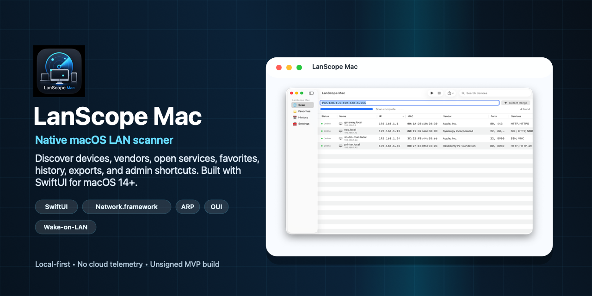
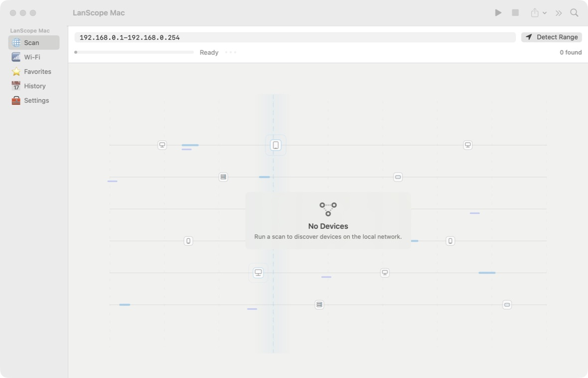
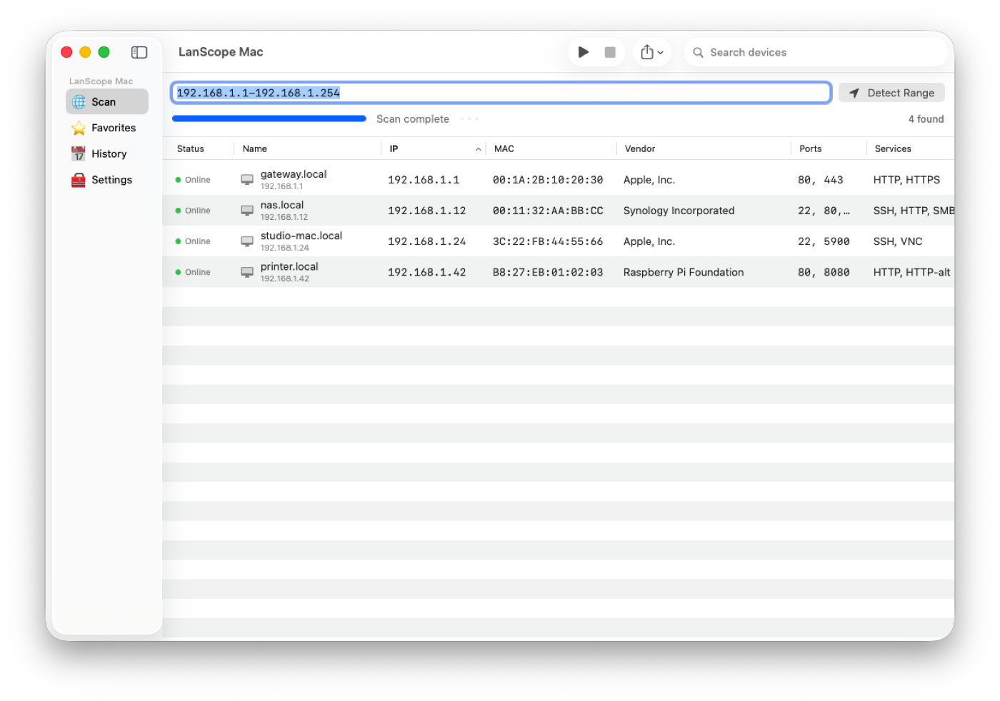
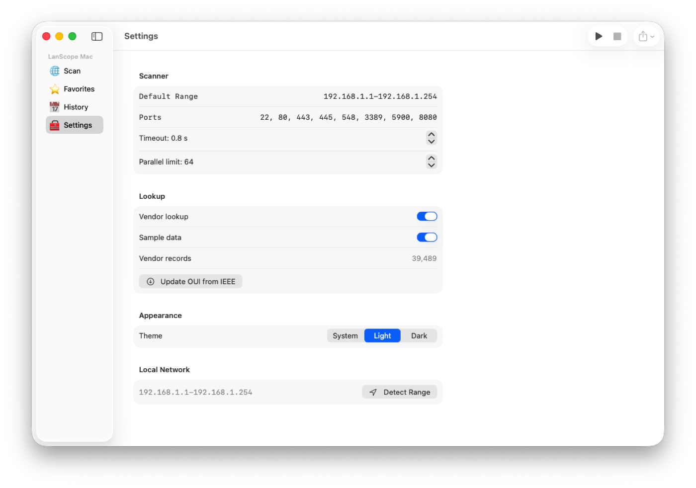

# LanScope Mac



[](https://github.com/Dezoff-max/lanscope-mac/actions/workflows/ci.yml)
[](https://github.com/Dezoff-max/lanscope-mac/releases/latest)
[](https://github.com/Dezoff-max/lanscope-mac/releases/latest)

LanScope Mac is a native macOS 14+ LAN scanner for local network administrators. It is built with Swift, SwiftUI, MVVM, async/await, and Network.framework.

Use LanScope Mac only on networks you own or are authorized to administer.

## Latest Release

Latest version: [v0.1.3](https://github.com/Dezoff-max/lanscope-mac/releases/tag/v0.1.3)

Download:

- [LanScope.Mac.dmg](https://github.com/Dezoff-max/lanscope-mac/releases/latest/download/LanScope.Mac.dmg)
- [LanScope.Mac.dmg.sha256](https://github.com/Dezoff-max/lanscope-mac/releases/latest/download/LanScope.Mac.dmg.sha256)

Release history is documented in [CHANGELOG.md](CHANGELOG.md).

## Screenshots







## MVP Features

- IP range input: `192.168.1.1-254`, full ranges such as `192.168.1.10-192.168.1.40`, single IP addresses, and CIDR ranges up to 4096 hosts.
- Local IPv4 range detection.
- Scan / Stop controls, progress reporting, and non-blocking scanning.
- Ping-based discovery and TCP port scanning for common services: SSH, HTTP, HTTPS, SMB, AFP, VNC, RDP, and HTTP-alt.
- Wi-Fi scanner for nearby networks with SSID, BSSID, signal, noise, channel, band, width, security, and PHY mode.
- Configurable timeout and parallel scan limit.
- ARP cache lookup through `/usr/sbin/arp` without root access.
- Local IEEE OUI database in `Resources/oui.json` with 39k+ vendor records.
- OUI database updates from Settings or with `script/update_oui_database.rb`.
- Favorites and scan history stored locally with UserDefaults.
- CSV / JSON export and selected-row clipboard copy.
- Quick actions: Browser, SSH through Terminal, SMB, VNC, Copy IP, Copy MAC, Favorite, and Wake-on-LAN.
- Sample data mode in Settings for testing the UI without scanning a real network.
- App icon, DMG volume icon, Finder layout, and custom DMG file icon from `Resources/AppIcon.icns`.

## Installation

See [INSTALL.md](INSTALL.md) for installation instructions.

The current MVP DMG is unsigned and not notarized. For public distribution, use GitHub Releases and clearly mark unsigned builds.

## Run in Xcode

1. Open `Package.swift` in Xcode.
2. Select the `LanScopeMac` scheme.
3. Make sure the run destination is My Mac.
4. Press Run.

If Xcode asks you to accept the license, run:

```bash
sudo xcodebuild -license
```

## Run from Terminal

```bash
/bin/bash ./script/build_and_run.sh
```

The script builds the SwiftPM executable target, stages a local app bundle in `dist/LanScope Mac.app`, copies resources, and launches it as a foreground macOS app.

Process verification:

```bash
/bin/bash ./script/build_and_run.sh --verify
```

Static validation:

```bash
/bin/bash ./script/validate_static.sh
```

Tests:

```bash
swift test
```

## Vendor / OUI Database

The bundled OUI database works offline. To update it from the official IEEE CSV:

```bash
./script/update_oui_database.rb
```

Source: `https://standards-oui.ieee.org/oui/oui.csv`.

The same action is available in Settings -> Lookup -> Update OUI from IEEE. User-updated data is stored in `~/Library/Application Support/LanScope Mac/oui.json` and takes precedence over bundled records.

## Build a DMG

```bash
/bin/bash ./script/package_dmg.sh
```

The artifact is created at `dist/LanScope Mac.dmg`.

The DMG contains:

- `LanScope Mac.app`
- `/Applications` shortcut
- `README.md`
- `INSTALL.md`
- `LICENSE`
- `PRIVACY.md`
- custom Finder layout and background
- app, volume, and DMG file icons

The DMG is intentionally not committed to git. Publish distributable builds through GitHub Releases.

## Release Workflow

To publish a new version, update [CHANGELOG.md](CHANGELOG.md) first, then run:

```bash
/bin/bash ./script/release.sh 0.1.2
```

The release script updates app metadata, runs validation and tests, builds the app bundle and DMG, verifies the DMG checksum, commits the version bump, pushes `main`, creates tag `v0.1.2`, and publishes a GitHub Release with the DMG assets.

## Architecture

- `App/` - app entry point and app-level state.
- `Features/Scanner` - scan screen and scan empty-state animation.
- `Features/WiFi` - Wi-Fi network scanner screen and Wi-Fi results table.
- `Features/Devices` - table, sidebar, and detail panel.
- `Features/Favorites` - favorite devices.
- `Features/History` - scan history.
- `Features/Settings` - scanner, lookup, sample data, and theme settings.
- `Core/NetworkScanner` - async scanner, TCP probes, service catalog.
- `Core/WiFiScanner` - CoreWLAN Wi-Fi scan integration and Location Services permission bridge.
- `Core/ARP` - macOS ARP cache reader.
- `Core/VendorLookup` - local OUI lookup and database updates.
- `Core/WakeOnLAN` - UDP magic packet support.
- `Core/Export` - CSV / JSON / clipboard export.
- `Models/` - Device, ScannerConfig, ScanHistory, and related models.
- `Persistence/` - UserDefaults persistence.
- `Utilities/` - IP parsing, local network detection, hostname resolution, and actions.

## MVP Limitations

- ICMP discovery uses system `/sbin/ping`; the app does not use raw sockets and does not require root access.
- TCP port scanning is implemented with Network.framework.
- Wi-Fi scanning uses public CoreWLAN APIs and does not require root access. macOS may require Location Services permission before SSID and BSSID are visible.
- MAC addresses are available only when macOS has the device in the ARP cache.
- Vendor lookup depends on the local OUI database. Randomized or locally administered MAC addresses are shown as `Locally Administered`, and missing OUIs are shown as `Unknown`.

## Security And Privacy

LanScope Mac is local-first. It does not send scan results, device data, favorites, or history to external services.

See [PRIVACY.md](PRIVACY.md) and [SECURITY.md](SECURITY.md).
